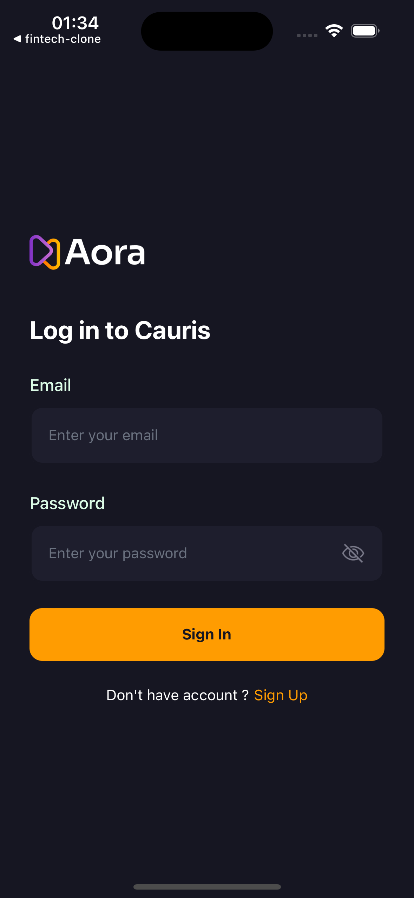
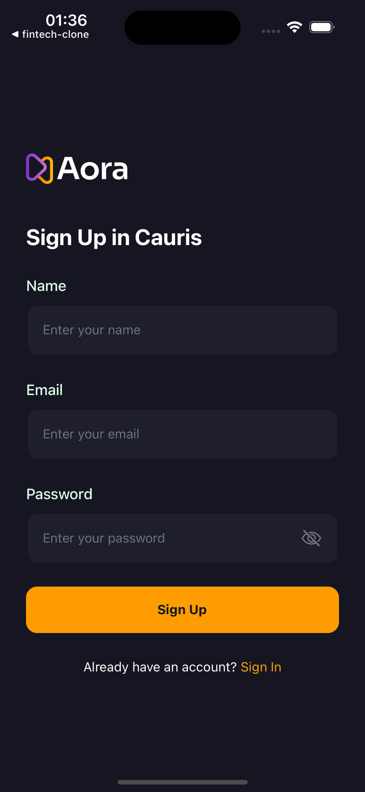
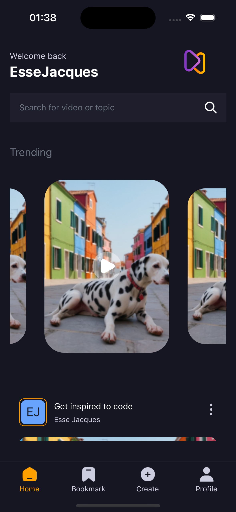
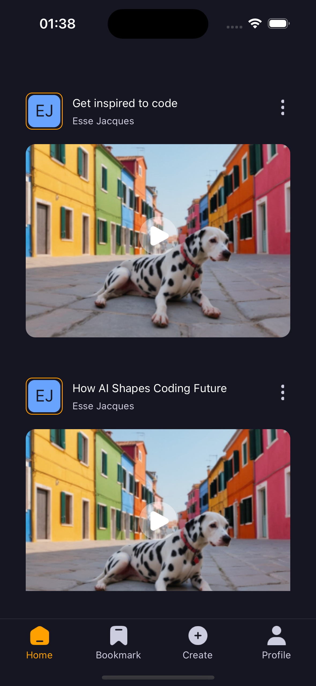
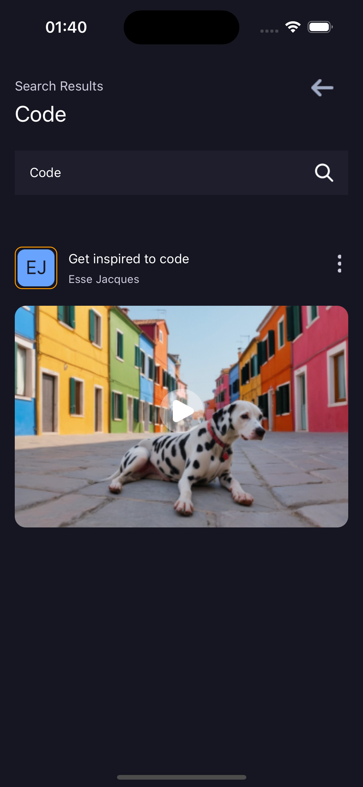
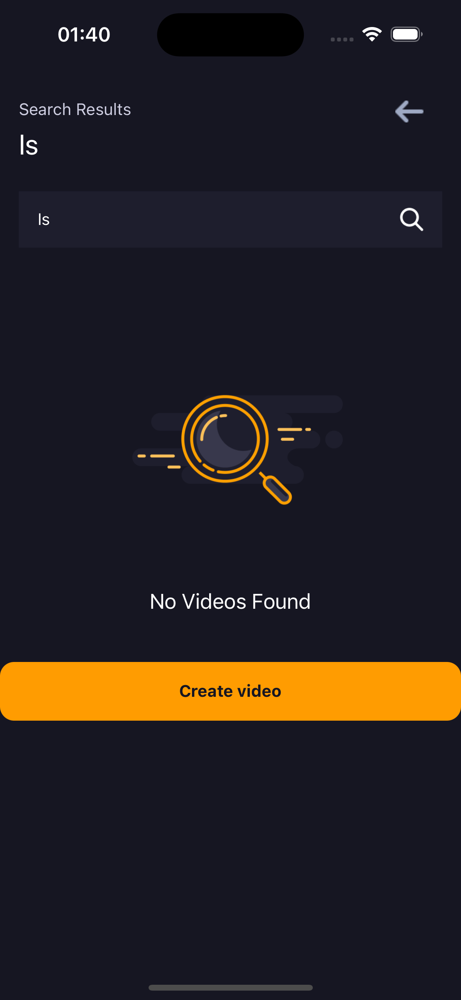
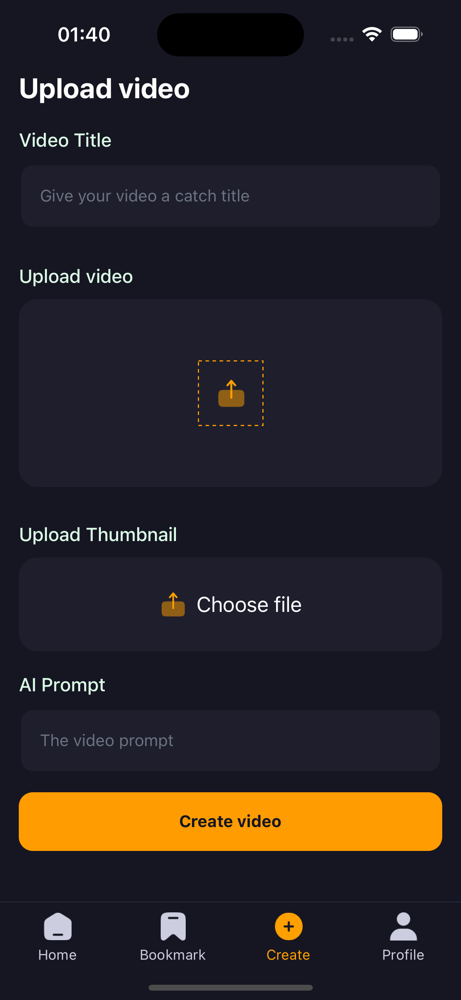
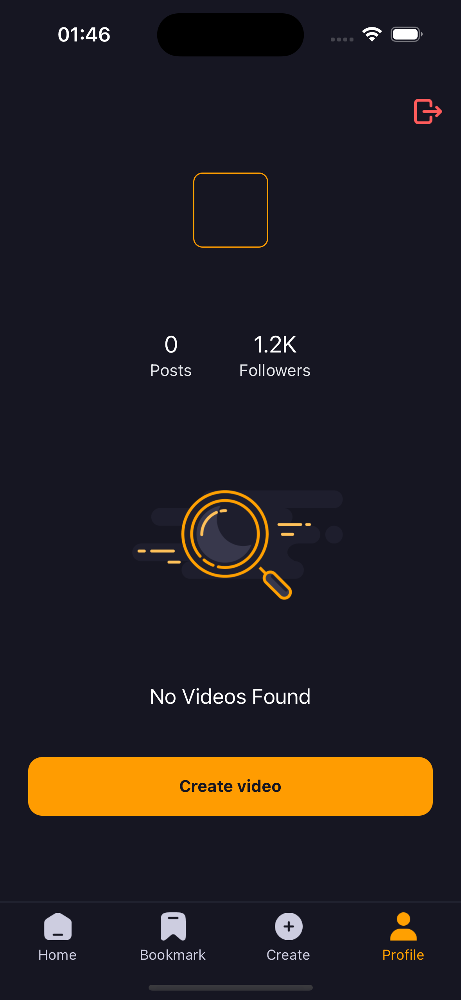
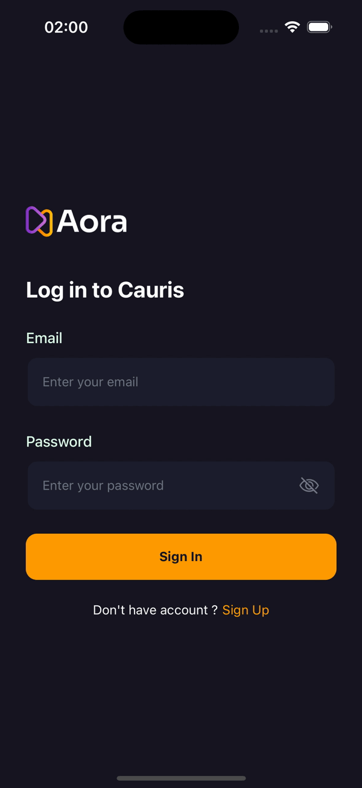

# Video Sharing App Clone

## Overview
This React Native Expo app is a clone of a popular video-sharing platform. It allows users to sign up, sign in, view a home feed, bookmark videos, create and upload new videos, and manage their profile. The app leverages modern technologies to provide a seamless and engaging user experience on both iOS and Android devices.

## Screenshots
<div style="display: flex; flex-direction: row; gap: 10px; flex-wrap: wrap;">
  
  
  
  
  
  
  
  
  
</div>

## Demo
<div style="display: flex; flex-direction: row; flex-wrap: wrap; gap: 10px;">
  
</div>

## Features
- **Sign Up & Sign In**: Secure user authentication and account management.
- **Home Feed**: Display of trending and recommended videos.
- **Bookmarking**: Users can bookmark their favorite videos for easy access.
- **Video Creation**: Tools for creating and uploading new videos.
- **Profile Management**: Users can manage their personal information and view their uploaded videos.

## Getting Started
To run the app locally, follow these steps:

1. **Clone the repository**:
   
    ```
    git clone https://github.com/esse-jacques-dansomon/react-native-video-app.git
    ```

2. **Navigate to the project directory**:
   
    ```
    cd react-native-video-app
    ```

3. **Install dependencies**:
  
    ```
    npm install
    ```

4. **Start the development server**:
   
    ```
    npm start
   ```
   This will launch the Expo development server.

5. **Scan QR Code**:
   Use the Expo Go app on your mobile device to scan the QR code displayed in the terminal or Expo Dev Tools. This will open the app on your device.

## Technologies Used
- **React Native**: Framework for building native mobile applications using JavaScript and React.
- **Expo**: A set of tools and services for building and deploying React Native apps.
- **Expo AV**: For handling audio and video playback.
- **Expo Document Picker**: For selecting documents and media files.
- **Redux**: State management library for managing application state.
- **React Navigation**: Routing and navigation library for React Native apps.
- **Firebase**: Backend services for authentication, database, and cloud functions.
- **NativeWind**: Styling library for React Native.
- **React Native Animatable**: For easy animations.
- **React Native Safe Area Context**: To handle safe area insets.
- **React Native Screens**: For native navigation primitives.

## Contributing
Contributions are welcome! If you'd like to contribute to this project, please follow these steps:
1. Fork the repository.
2. Create a new branch (`git checkout -b feature/your-feature`).
3. Make your changes.
4. Commit your changes (`git commit -m "Add new feature"`).
5. Push to the branch (`git push origin feature/your-feature`).
6. Create a pull request.

## License
This project is licensed under the [MIT License](LICENSE).